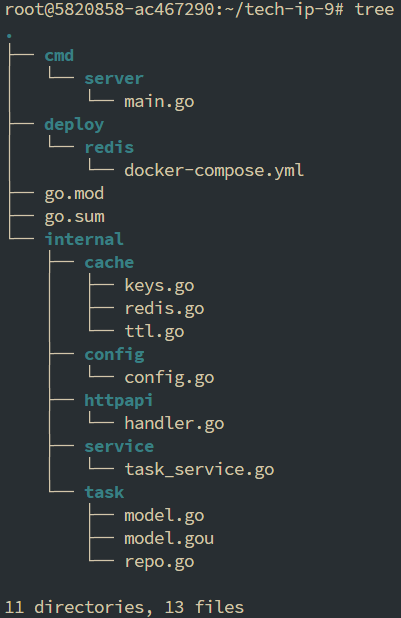
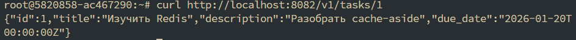
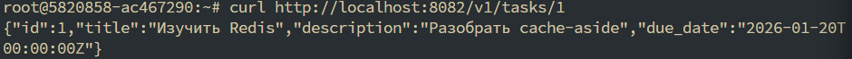
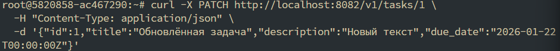
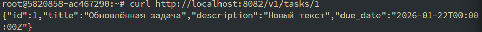
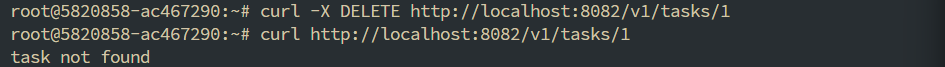
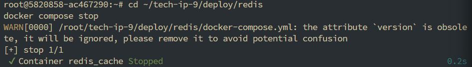
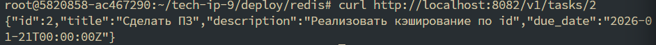
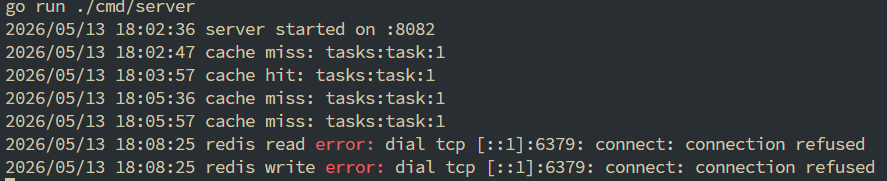

# Практическое занятие №9: Реализация распределённого кэша (Redis cluster)

## Описание

В рамках практической работы реализована стратегия cache-aside для Go-сервиса `tasks` с использованием Redis в качестве внешнего кэша.  
Реализованы:
- Кэширование чтения задачи по идентификатору
- TTL с jitter для равномерного истечения ключей
- Инвалидация кэша при обновлении и удалении задачи
- Деградация сервиса при недоступности Redis

---

## Структура проекта



### 1. Запуск Redis

```bash
cd deploy/redis
docker compose up -d
```

### 2. Запуск сервиса

```bash
go run ./cmd/server
```

### 3. Проверка кэширования (cache‑aside)

Первый запрос (cache miss)


Второй запрос (cache hit)


### 4. Обновление задачи (инвалидация кэша)

Ответ (обновлённые данные):


### 5. Удаление задачи


### 6. Деградация при недоступности Redis

Ответ приходит из репозитория (in-memory):


### 7. Логи


### 8. Выводы

- Реализована стратегия cache-aside: сначала чтение из Redis, при промахе — из БД (in-memory репозитория), затем запись в кэш.

- Использован TTL с jitter (120 с ± случайная добавка до 30 с) для предотвращения одновременного истечения ключей.

- Кэш инвалидируется при операциях изменения (PATCH) и удаления (DELETE).

- При отказе Redis сервис не падает, а продолжает работу через основное хранилище.

- Все ключи кэша формируются по единому шаблону.
